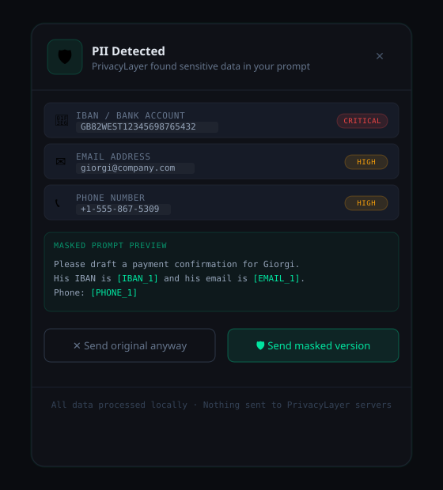
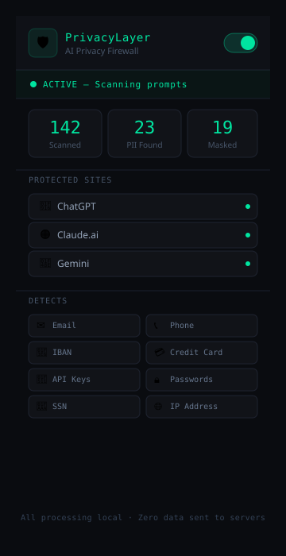

# 🛡️ PrivacyLayer — AI Privacy Firewall

> **A browser extension that acts as a privacy middleware layer between users and AI models — intercepting prompts, detecting sensitive data, and preventing accidental PII leakage into LLMs like ChatGPT, Claude, and Gemini.**

Built by **Liza Ulumboeli** · QA Analyst & AI Governance Practitioner · [LinkedIn](https://www.linkedin.com/in/liza-ulumboeli)

---

## 🎯 The Problem

Every day, knowledge workers paste sensitive information into AI assistants without realizing it:

- A finance analyst copies a client's IBAN into ChatGPT to draft a payment email
- A lawyer includes a client's SSN when asking Claude to summarize a document
- A developer accidentally pastes a live API key into Gemini while debugging

**This isn't a behavior problem — it's a missing infrastructure problem.** There is no guardrail between the user's keyboard and the LLM.

Regulatory frameworks including GDPR, CCPA, and the EU AI Act impose strict requirements on how personal data is processed by third-party AI systems. Organizations that allow unrestricted LLM usage are accumulating compliance risk they may not yet recognize.

---

## 💡 The Solution

**PrivacyLayer** is a Chrome extension that acts as a real-time privacy firewall. Before any prompt is sent to an AI model, PrivacyLayer:

1. Intercepts the text at the browser level
2. Scans for sensitive entities using pattern matching and NLP
3. Presents the user with a confirmation modal showing exactly what was detected
4. Replaces sensitive values with anonymous tokens (e.g. `[EMAIL_1]`, `[IBAN_1]`)
5. Sends only the sanitized prompt to the LLM

All processing happens **locally in the browser**. No data is sent to any PrivacyLayer server.

---

## 🖥️ Demo

```
User types:
"Please draft a payment confirmation for Giorgi. His IBAN is GB82WEST12345698765432
and his email is giorgi@company.com."

PrivacyLayer detects:
  🏦 IBAN — GB82WEST12345698765432   [CRITICAL]
  ✉️ Email — giorgi@company.com      [HIGH]

User confirms masking. Prompt sent to LLM:
"Please draft a payment confirmation for Giorgi. His IBAN is [IBAN_1]
and his email is [EMAIL_1]."
```

---

## 📸 Screenshots

### The Detection Modal
When PrivacyLayer finds PII in your prompt, this modal appears before the message is sent to the LLM. It shows exactly what was detected, severity levels, and a preview of the masked version.



### The Extension Popup
Click the 🛡️ icon in the Chrome toolbar to see protection status, supported sites, and detected entity types.



---

## 🔍 PII Entities Detected (MVP)

| Entity | Example | Severity |
|--------|---------|----------|
| ✉️ Email Address | user@company.com | High |
| 📞 Phone Number | +1-555-867-5309 | High |
| 🏦 IBAN / Bank Account | GB82WEST12345698765432 | Critical |
| 💳 Credit Card | 4111 1111 1111 1111 | Critical |
| 🔑 API Key / Secret | sk-proj-xK9m... | Critical |
| 🔒 Password | password: mySecret! | Critical |
| 🪪 Social Security Number | 123-45-6789 | Critical |
| 🌐 IP Address | 192.168.1.1 | Medium |

---

## 🏗️ Architecture

```
┌─────────────────────────────────────────────────┐
│                 USER BROWSER                    │
│                                                 │
│  User types prompt                              │
│         ↓                                       │
│  Content Script (DOM Observer)                  │
│  → Intercepts on Enter / Send click             │
│         ↓                                       │
│  PII Detection Engine (local, browser-side)     │
│  → Regex fast-path: emails, IBANs, phones       │
│  → Pattern matching: API keys, passwords        │
│         ↓                                       │
│  Confirmation Modal → User approves/cancels     │
│         ↓                                       │
│  Token Vault (in-memory session Map)            │
│  → Original values never leave the device       │
│         ↓                                       │
│  Masked prompt sent to LLM                      │
└─────────────────────────────────────────────────┘
```

**Tech Stack (MVP):**
- Chrome Extension (Manifest V3)
- Vanilla JavaScript + DOM API
- Regex-based PII detection engine
- In-memory token vault (session-scoped)
- CSS3 animations for modal UI

---

## 🚀 Installation

### Load as unpacked extension (Developer Mode)

1. Download or clone this repository
2. Open Chrome and navigate to `chrome://extensions`
3. Enable **Developer mode** (toggle, top-right)
4. Click **"Load unpacked"**
5. Select the `privacy-layer-extension` folder
6. The 🛡️ icon will appear in your toolbar

**Supported sites:** ChatGPT · Claude.ai · Gemini

---

## 📋 Product Specification

### Problem Statement
Knowledge workers using AI assistants have no friction point between intent and data leakage. Existing enterprise DLP (Data Loss Prevention) tools operate at the network layer and cannot inspect content typed in real time. A browser-native solution is needed.

### Target Users
- **Primary:** Finance, legal, and healthcare professionals using LLMs for productivity
- **Secondary:** Developers using AI coding assistants (GitHub Copilot, Cursor)
- **Enterprise:** Compliance and IT teams needing auditable AI usage policies

### User Stories
- *As a finance analyst*, I want to be warned before I accidentally send client account numbers to an AI model
- *As a compliance officer*, I want a log of what PII was detected and masked across my team's AI usage
- *As an IT administrator*, I want to deploy organization-wide PII masking policies without requiring user action

### Success Metrics
| Metric | MVP Target |
|--------|-----------|
| PII detection accuracy (precision) | >90% |
| False positive rate | <5% |
| Modal-to-mask conversion rate | >70% |
| Latency added to send action | <300ms |

### Out of Scope (MVP)
- Name/person entity detection (requires NLP backend)
- Response scanning
- Persistent cross-session vault
- Enterprise admin dashboard

---

## 🗺️ Roadmap

### Phase 1 — MVP (Complete ✅)
- [x] Chrome extension with content script injection
- [x] Regex-based PII detection (8 entity types)
- [x] Confirmation modal with masked preview
- [x] In-memory token vault
- [x] Support for ChatGPT, Claude.ai, Gemini

### Phase 2 — Pro (Q3 2026)
- [ ] NLP-based name/person detection (Microsoft Presidio + FastAPI sidecar)
- [ ] Persistent encrypted vault (IndexedDB + AES-256)
- [ ] Response scanning (detect if LLM echoes PII back)
- [ ] Slack AI + Gmail support
- [ ] Pro subscription tier ($12/mo via Stripe)

### Phase 3 — Enterprise (Q1 2027)
- [ ] Team policy management dashboard
- [ ] Audit log export (GDPR Article 30 format)
- [ ] SAML/SSO integration
- [ ] On-premise Docker deployment
- [ ] EU AI Act compliance report templates

---

## 🧪 Engineering Quality & Trust

A privacy tool is only as credible as its engineering rigor. Beyond features, the next phase of investment goes into making PrivacyLayer trustworthy in a real production environment:

### Testing infrastructure
Comprehensive test coverage is non-negotiable for a tool users grant access to their prompts:
- **Unit tests** for each PII detector — measuring precision and recall per entity type, with fixtures covering edge cases (e.g., partial IBANs, internationally formatted phone numbers, false-positive-prone strings like tracking IDs)
- **Cross-site UI tests** — Playwright-driven flows on ChatGPT, Claude, and Gemini that verify modal interception survives upstream DOM changes (these sites update frequently)
- **Regression tests** for DOM interception logic — guards against React rerender races, SPA navigation, and contenteditable focus edge cases

### Confidence scoring
Detection should not be binary. Each finding will carry a **confidence score (0–100)** derived from context — a 16-digit number adjacent to an expiry date is far more likely a credit card than a tracking ID. The modal will surface both *severity* and *certainty*, giving users a meaningful signal rather than a wall of warnings.

### Customizable policies
Different roles need different defaults. A policy engine lets users (or admins) codify rules like:
- *"Always mask emails"* — for sales and support
- *"Warn only on financial identifiers"* — for engineering teams
- *"Block secrets completely"* — for DevOps and SRE

This becomes the foundation for the Phase 3 enterprise tier, where compliance teams can ship organization-wide policies.

### Response-side scanning
The current MVP protects the input side. But LLMs can still echo sensitive data back — from earlier turns, from training data, or from connected tools. Phase 2 introduces **response scanning**: detect when the model emits PII in its output and surface it to the user before the response is rendered. This is where most enterprise DLP tools fail today.

### Performance benchmarking
The README claims a <300ms target latency for the send-to-modal path. A benchmarking harness will measure and publish:
- Detection latency across prompt sizes (50, 500, 5,000 tokens)
- Modal render-to-decision time
- Memory overhead of the token vault under sustained use

Results will live in a `BENCHMARKS.md` and run in CI to catch regressions.

---

## ⚖️ Compliance & Governance Context

This project was designed with AI governance frameworks in mind:

- **GDPR / CCPA:** Prevents personal data from being transmitted to third-party AI processors without explicit user awareness
- **EU AI Act:** Supports transparency obligations by making users aware of what data is being processed
- **NIST AI RMF:** Addresses the *Govern* and *Manage* functions by creating a human-in-the-loop checkpoint before data reaches an AI system
- **SOC 2 (Type II):** Audit log capability (Phase 3) supports evidence collection for AI usage controls

---

## 🏆 Competitive Landscape

| Product | Approach | Gap |
|---------|---------|-----|
| Nightfall AI | Cloud API for developers | No end-user browser UX |
| Private AI | On-prem PII redaction | Developer-only, no extension |
| Microsoft Presidio | Open-source library | No product layer |
| Polymer DLP | Google Workspace DLP | Not LLM-focused |

**PrivacyLayer's differentiator:** The only solution targeting individual knowledge workers with a zero-friction browser UX, local-first processing, and explicit AI governance alignment.

---

## 🧠 What I Learned Building This

This project sits at the intersection of my background in QA, FinTech compliance, and AI governance. Key insights:

**On product:** The hardest problem isn't PII detection — it's the UX of interruption. A firewall that users disable because it's annoying is worse than no firewall. Every design decision in the modal was made to minimize friction while maximizing informed consent.

**On technical:** Browser extensions have significant limitations in MV3 (Manifest V3). Real-time DOM interception across React-based SPAs like ChatGPT requires careful MutationObserver usage and site-specific selectors that break when sites update.

**On governance:** Tokenization (replacing PII with reversible tokens) is fundamentally different from redaction (permanent removal). For most enterprise use cases, tokenization is preferable because it preserves the utility of the AI response while protecting the data in transit.

---

## 👩‍💻 About the Author

**Liza Ulumboeli** is a QA Analyst and AI Governance practitioner with 7+ years of experience across FinTech, Healthcare, and E-commerce. She holds the **Microsoft Azure AI Fundamentals (AI-900)** and **PSPO I** certifications and is pursuing the **IAPP AI Governance Professional (AIGP)** credential.

Her work focuses on the intersection of AI product development, compliance, and responsible AI deployment in regulated industries.

📎 [LinkedIn](https://www.linkedin.com/in/liza-ulumboeli) · 📧 [Contact](mailto:lizaulu12@gmail.com)

---

## 📄 License

MIT License — free to use, modify, and distribute with attribution.

---

*PrivacyLayer is an independent research and portfolio project. It is not affiliated with Anthropic, OpenAI, or Google.*
